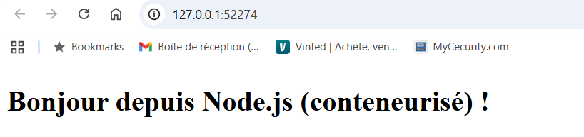

## GIRARD Lucas - 5ESGI IW - TP #3 : Déploiement d’une image depuis un registre privé sur le cluster Kubernetes

### Livrables

Docker images : 
REPOSITORY          TAG       IMAGE ID       CREATED          SIZE
tp-docker-hub-app   latest    77350b347c01   37 minutes ago   138MB

Pods:
NAME                                 READY   STATUS    RESTARTS   AGE    IP           NODE       NOMINATED NODE   READINESS GATES
tp-docker-hub-app-5796687bb8-5jglc   1/1     Running   0          9m8s   10.244.0.6   minikube   <none>           <none>

Accès web : http://127.0.0.1:52274/



Optimisations dans le Dockerfile :
- On utilise l'image node20-alpine qui est beaucoup plus légère que node20 classique car cela permet une légereté de l'image docker finale.
- On utilise du multistage ce qui permet d'appeler et d'utiliser que les dépendances nécéssaires

ImagePullSecret permet de fournir les identifiants d'accès de notre Docker Hub à kubernetes pour qu'il soit en capacité d'aller récupérer une image sur notre registry privé.

On le crée avec cette commande :
```bash
kubectl create secret docker-registry regcred \
  --docker-server=https://index.docker.io/v1/ \
  --docker-username=<docker-hub-user> \
  --docker-password=<token> \
  --docker-email=<email>
```